# Configure-Azure-Vnet-peering

## What is Vnet Peering in Azure??

### **VNet Peering in Azure**  

**VNet Peering** is a feature in Azure that connects two **Virtual Networks (VNets)** so that they can communicate **privately** with each other as if they were part of the same network.  

### **Key Points:**  
- Allows **low-latency, high-speed communication** between VNets.  
- VNets can be in the **same** or **different Azure regions** (Global VNet Peering).  
- No need for **VPN gateways** or **public IPs**—traffic remains within Azure’s backbone network.  
- Can be used for **cross-region networking, resource sharing, or hybrid cloud solutions**.  

It is mainly used when you want to **connect different VNets securely** while maintaining network isolation. 🚀

### **Summary: Configuring VNet Peering in Azure**  

In this project, I set up **two Virtual Networks (VNets)**, each containing **one Virtual Machine (VM)**. To enable communication between the VMs, I configured **VNet Peering**, which allows the VNets to connect and exchange traffic securely over Azure’s private network. This setup ensures seamless connectivity without requiring VPN gateways or public IPs, demonstrating how VNet Peering can be used for efficient and secure inter-VNet communication.

## Step - 1

i. Configure the **Virtual Networks (VNets)** by creating two separate VNets, each assigned with its own address space.

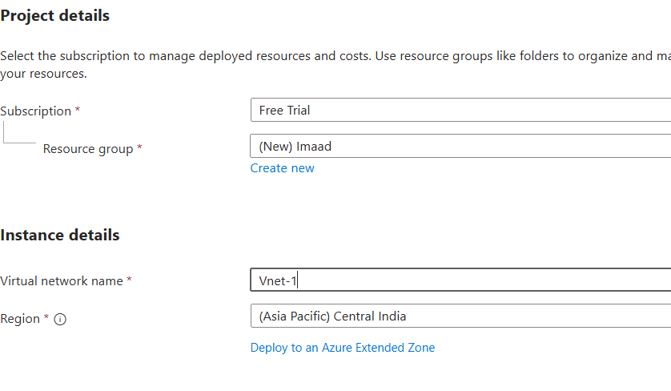

ii. Create the **first VNet** with the specified **IP address range**.

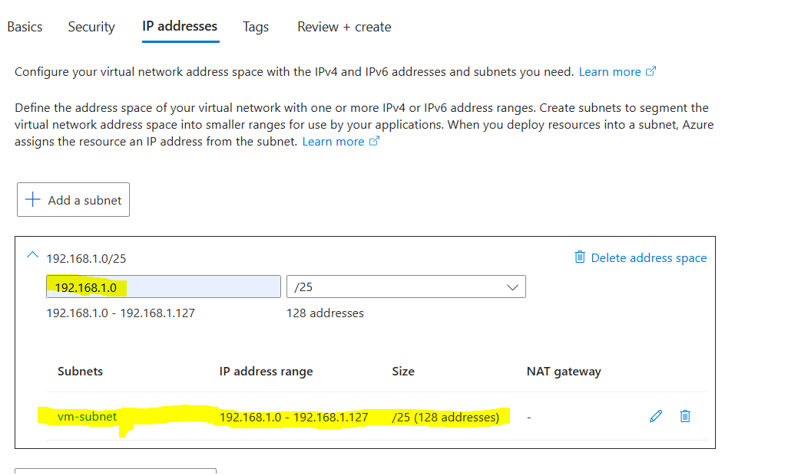

iii. Create the **second VNet** with the specified **IP address range**.

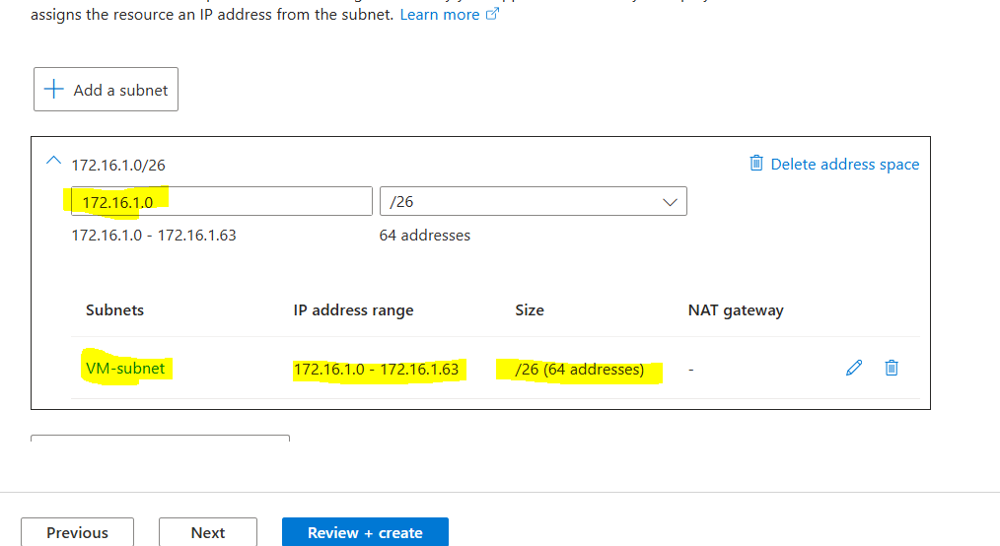

## Step - 2

i. Now, create the **first Virtual Machine (VM)** and ensure that you select the **correct VNet (VNet-1)** during the setup.

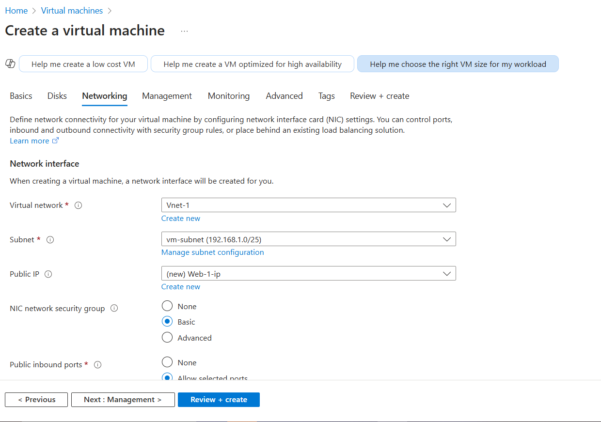

ii. Create the **second Virtual Machine (VM)** and ensure that you select **VNet-2** during the setup.

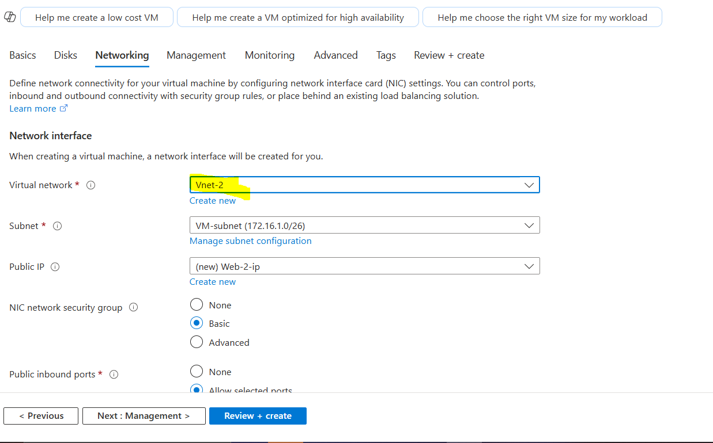

## Step - 3

i. Connect to both **VMs using RDP**, then **turn off the firewall** on both VMs to allow seamless communication between them.

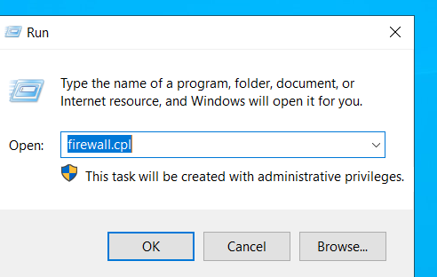

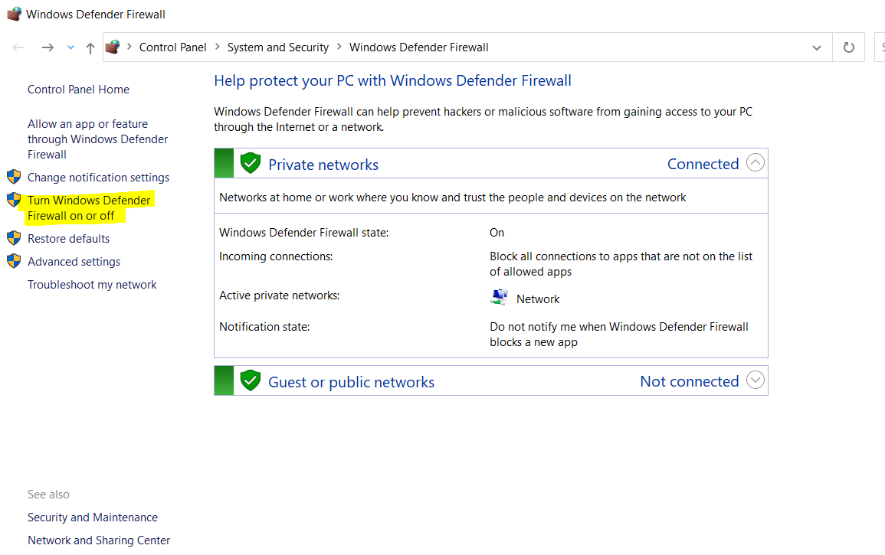

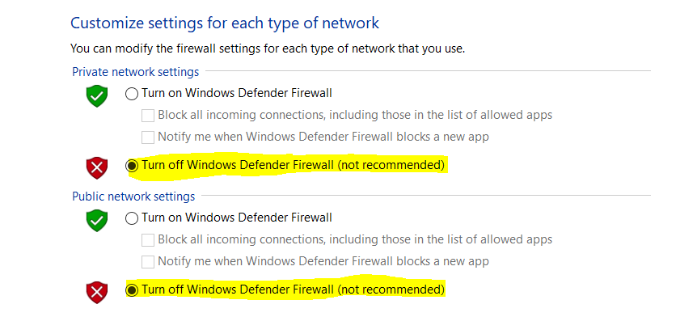

## Step - 4

i. Navigate to **Virtual Network**, select the **VNet** you created, go to the **Peering** section, and click on the **Add** button.

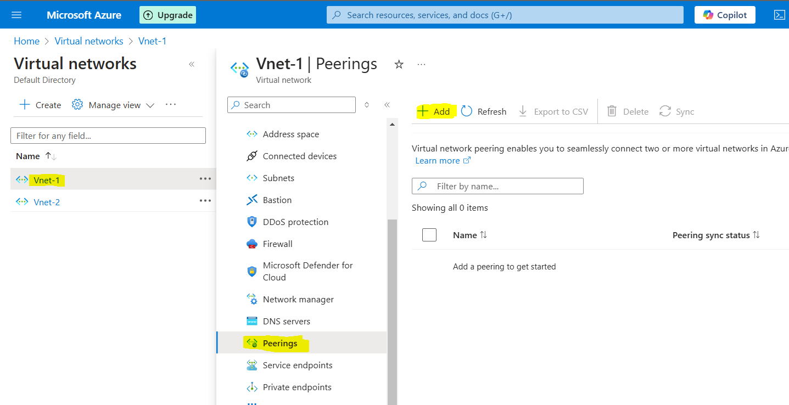

ii. Assign a name to the **peering link**, select the **virtual network** you want to establish communication with, and click **Save**.

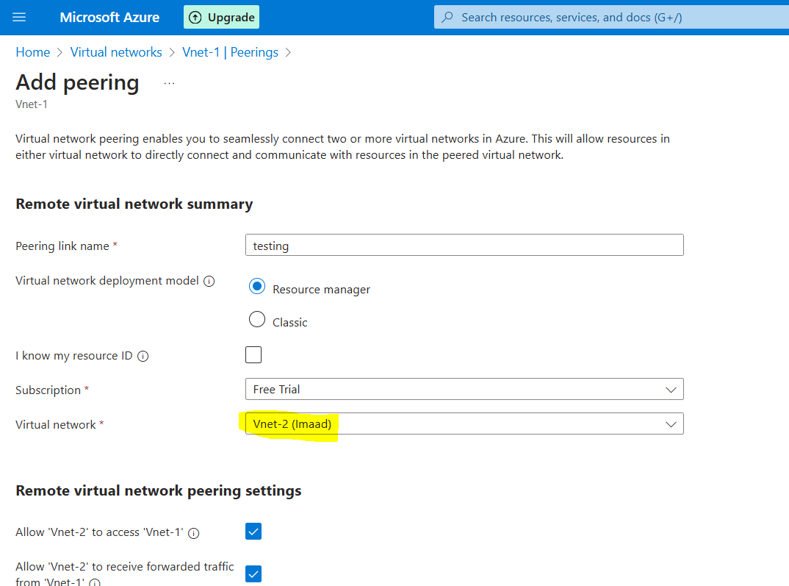

iii. Once the **VNet Peering** is configured, test the connection by **pinging between the VMs**—they should now be able to communicate successfully.

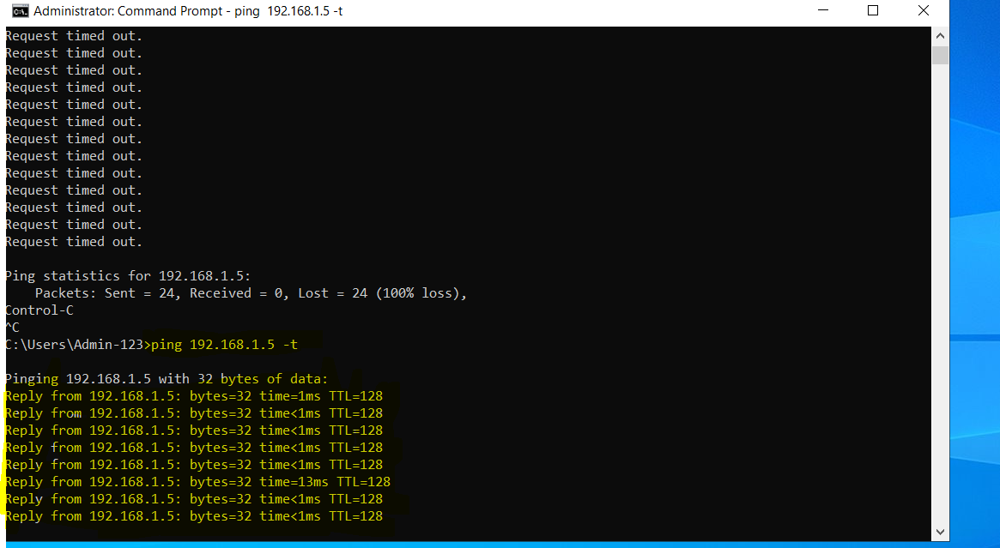
